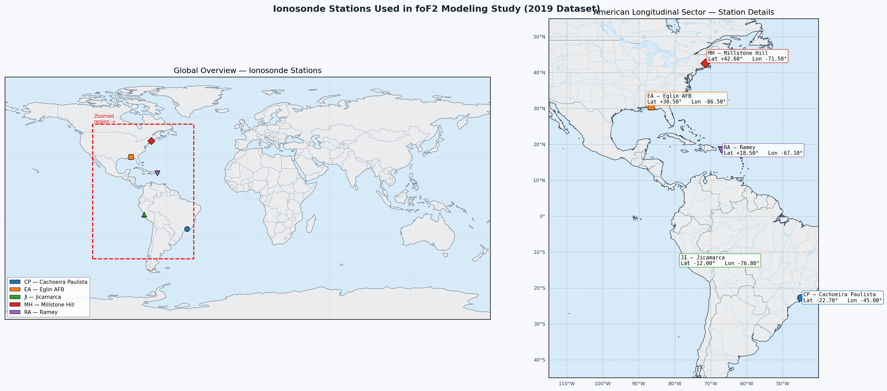

# Ionospheric foF2 Modeling — ANN, ML, and IRI-2020

Predicting the ionospheric critical frequency foF2 over the American longitudinal sector using 2019 ionosonde data. Four models are compared: Linear Regression, Quadratic Regression, an Artificial Neural Network (PyTorch), and the empirical IRI-2020 model (CCIR and URSI coefficients). A secondary ANN evaluation investigates model sensitivity to geomagnetic activity, local time, and seasonal extremes.

Target publication: **Advances in Space Research**

---

## Table of Contents

1. [Background](#background)
2. [Dataset](#dataset)
3. [Station Map](#station-map)
4. [Project Structure](#project-structure)
5. [Input Features](#input-features)
6. [Models](#models)
7. [ANN Evaluation Scenarios](#ann-evaluation-scenarios)
8. [IRI Evaluation Scenarios](#iri-evaluation-scenarios)
9. [Comparison Plots](#comparison-plots)
10. [Installation](#installation)
11. [Usage](#usage)
12. [Outputs](#outputs)

---

## Background

The F2 layer critical frequency (foF2) is a key parameter of the ionosphere that controls HF radio propagation. It is highly variable, driven by solar activity, geomagnetic conditions, and local time. Empirical models like IRI-2020 capture the climatological mean but may underperform during geomagnetically disturbed periods or at specific local times. This project trains data-driven models on direct ionosonde measurements and benchmarks them against IRI-2020 (both CCIR and URSI coefficient sets).

---

## Dataset

- **Source**: Ionosonde measurements from five stations in the American longitudinal sector, 2019 (full year)
- **Solar index**: Daily F10.7 solar flux index from NOAA
- **Geomagnetic classification**: NOAA monthly quiet/disturbed day lists (`quiet_and_disturbed.txt`) based on the planetary Kp index
- **Master file**: `FINAL_MASTER.csv` — 37,035 rows after cleaning
- **Note**: Solstice and equinox dates are **excluded** from `FINAL_MASTER.csv`. Held-out observations for those dates are stored in `ann_evals/data/equinox_solstice.csv` and used for out-of-distribution evaluation (Scenario 5).

### Five Stations

| Code | Location | Latitude | Longitude (°E) | Longitude (°W) | UTC Offset |
|------|----------|----------|----------------|----------------|------------|
| CP | Cachoeira Paulista, Brazil | −22.70° | 315.00° | 45.00° W | UTC −3 (BRT) |
| JI | Jicamarca, Peru | −12.00° | 283.20° | 76.80° W | UTC −5 (PET) |
| EA | Eglin AFB, Florida, USA | 30.50° | 273.50° | 86.50° W | UTC −6 (CST) |
| RA | Ramey, Puerto Rico | 18.50° | 292.90° | 67.10° W | UTC −4 (AST) |
| MH | Millstone Hill, Massachusetts, USA | 42.60° | 288.50° | 71.50° W | UTC −5 (EST) |

Local time is computed using **fixed standard-time UTC offsets (no DST)**: `LT = (UTC_hour + offset) % 24`.

---

## Station Map



`station_map.py` generates the figure above. It requires `cartopy` and downloads Natural Earth shapefiles on first run. The left panel shows all five stations on a global map; the right panel zooms into the American longitudinal sector with station codes, full names, and coordinates.

---

## Project Structure

```
Ionospheric-foF2-Modeling-ANN-ML-IRI/
│
├── FINAL_MASTER.csv                  Master dataset (37,035 rows, 5 stations)
├── quiet_and_disturbed.txt           NOAA Kp-based quiet/disturbed day list
├── station_map.py                    Cartopy station location figure
├── station_map.png                   Generated station map (global + Americas zoom)
├── compare_models.py                 Final model comparison and scatter plots
├── generate_predictions.py           Run all ML models and collect predictions
├── run_iri.py                        IRI-2020 predictions via Fortran (Linux only)
│
├── models/                           Core model implementations
│   ├── python_scripts/
│   │   ├── linear_regression.py
│   │   ├── quadratic_regression.py
│   │   └── ann_pytorch.py
│   └── notebooks/
│       ├── linear_regression.ipynb
│       ├── quadratic_regression.ipynb
│       └── ann_pytorch.ipynb
│
├── ann_evals/                        ANN sensitivity evaluation (5 scenarios)
│   ├── python_scripts/
│   │   ├── prepare_datasets.py          Build filtered scenario datasets
│   │   ├── train_full.py                Scenario 1 — full dataset (70/15/15 split)
│   │   ├── train_no_quiet.py            Scenario 2 — exclude quiet days
│   │   ├── train_no_disturbed.py        Scenario 3 — exclude disturbed days
│   │   ├── train_no_midday_midnight.py  Scenario 4 — exclude midday & midnight
│   │   └── predict_equinox_solstice.py  Scenario 5 — OOD eval on equinox/solstice
│   ├── notebooks/
│   │   ├── prepare_datasets.ipynb
│   │   ├── scenario1_full.ipynb
│   │   ├── scenario2_no_quiet.ipynb
│   │   ├── scenario3_no_disturbed.ipynb
│   │   ├── scenario4_no_midday_midnight.ipynb
│   │   └── predict_equinox_solstice.ipynb
│   ├── data/                            Filtered CSVs (generated by prepare_datasets)
│   │   ├── equinox_solstice.csv
│   │   ├── master_no_quiet.csv          Hour = UTC
│   │   ├── master_no_disturbed.csv      Hour = UTC
│   │   ├── master_no_midday_midnight.csv  Hour = standard local time
│   │   ├── quiet_days_only.csv          Hour = UTC
│   │   ├── disturbed_days_only.csv      Hour = UTC
│   │   └── midday_midnight_only.csv     Hour = standard local time
│   └── outputs/
│       ├── scenario1_full/              model, loss curve, scatter, predictions
│       ├── scenario2_no_quiet/
│       ├── scenario3_no_disturbed/
│       ├── scenario4_no_midday_midnight/  combined + midday-only + midnight-only scatters
│       └── scenario5_equinox_solstice/
│
├── iri_evals/                        IRI-2020 evaluation (same scenarios as ANN 2–5)
│   ├── quiet_days_only_IRI.csv          IRI predictions — quiet days
│   ├── disturbed_days_only_IRI.csv      IRI predictions — disturbed days
│   ├── midday_midnight_only_IRI.csv     IRI predictions — midday/midnight (LT hour)
│   ├── equinox_solstice_IRI.csv         IRI predictions — equinox/solstice
│   ├── python_scripts/
│   │   └── make_iri_scatter.py          Scatter plots for IRI-CCIR and IRI-URSI
│   ├── notebooks/
│   │   └── make_iri_scatter.ipynb
│   └── outputs/
│       ├── scenario2_no_quiet/          iri_ccir_*.png + iri_ursi_*.png
│       ├── scenario3_no_disturbed/
│       ├── scenario4_no_midday_midnight/  combined + midday-only + midnight-only
│       └── scenario5_equinox_solstice/
│
├── plots/                            Cross-model pseudo-color comparison plots
│   ├── data/                            Copies of ANN and IRI prediction CSVs
│   │   ├── scenario1_full/
│   │   ├── scenario2_no_quiet/
│   │   ├── scenario3_no_disturbed/
│   │   ├── scenario4_no_midday_midnight/
│   │   └── scenario5_equinox_solstice/
│   ├── python_scripts/
│   │   └── make_pseudocolor_plots.py
│   ├── notebooks/
│   │   └── make_pseudocolor_plots.ipynb
│   └── outputs/
│       ├── scenario1_full/              CP.png  ElginAB.png  Jicamarca.png  …
│       ├── scenario2_no_quiet/
│       ├── scenario3_no_disturbed/
│       ├── scenario4_no_midday_midnight/
│       └── scenario5_equinox_solstice/
│
├── outputs/                          Main model outputs
│   ├── best_model.pt
│   ├── linear_model.joblib / quadratic_model.joblib
│   ├── predictions_linear.csv / predictions_quadratic.csv
│   ├── predictions_ann.csv
│   ├── predictions_iri.csv           Full-year IRI-CCIR + IRI-URSI predictions
│   ├── model_comparison.csv
│   ├── comparison_per_station.csv
│   └── *.png
│
└── Fof2 Data/                        Raw and preprocessed source data
    ├── raw_txt_fof2_files/
    ├── preprocessed_fof2_csvs/
    └── Scripts/
```

---

## Input Features

All models use the same minimal feature set:

| Feature | Description | Unit |
|---------|-------------|------|
| `DayOfYear` | Day of year | 1–365 |
| `Hour` | UTC hour (or standard local time for Scenario 4) | 0–23 |
| `Longitude` | Station longitude | degrees (0–360) |
| `Latitude` | Station latitude | degrees (−90–90) |
| `F10.7` | Daily solar flux index | sfu |

**Target**: `foF2` (MHz)

---

## Models

### Linear Regression (`models/python_scripts/linear_regression.py`)
Ordinary least squares on the 5 features. Provides a baseline.

### Quadratic Regression (`models/python_scripts/quadratic_regression.py`)
Polynomial features of degree 2 before linear regression. Captures basic non-linearity.

### ANN — PyTorch (`models/python_scripts/ann_pytorch.py`)

| Parameter | Value |
|-----------|-------|
| Architecture | Input(5) → 16 → 32 → 64 → 128 → 64 → 32 → 16 → Output(1) |
| Activations | ReLU (hidden layers), linear (output) |
| Normalisation | z-score computed on training split, applied at inference |
| Optimizer | Adam, lr = 1e-3 |
| Loss | MSE |
| Batch size | 128 |
| Max epochs | 200 |
| Early stopping | patience = 12 (validation MSE) |

Checkpoints bundle model weights together with `train_mean` and `train_std`, making inference fully self-contained.

### IRI-2020 (`run_iri.py`)
Drives the **IRI-2020 Fortran source code** directly:
1. Writes a Fortran batch driver that accepts `lat lon year doy hour F10.7 F10.7_81` on stdin and outputs `foF2_CCIR foF2_URSI` per line
2. Compiles everything with `gfortran -O3`
3. Pipes the full dataset through the compiled executable

Both CCIR and URSI coefficient sets are evaluated. Daily and 81-day average F10.7 are injected via IRI JF switches, bypassing IRI's internal index files.

> **Platform requirement**: `run_iri.py` must be run on **Linux**. It requires `gfortran` and the IRI-2020 Fortran source files (`.for` / `.asc` / `.dat`) placed in `WORK_DIR` (hardcoded at the top of the script). Use WSL, a remote Linux server, or a Docker container when developing on Windows.

---

## ANN Evaluation Scenarios

Located in `ann_evals/`. Assesses how geomagnetic conditions, local time, and seasonal extremes influence ANN generalisation.

### Local Time Convention

For Scenario 4, the `Hour` column in `master_no_midday_midnight.csv` and `midday_midnight_only.csv` is replaced with **standard local time** (fixed UTC offsets, no DST):

| Window | Standard LT hours |
|--------|-------------------|
| Midday | 11, 12, 13 |
| Midnight | 23, 0, 1 |

All other scenario CSVs keep UTC hours.

### Scenario Overview

| # | Script | Train on | Evaluate on |
|---|--------|----------|-------------|
| 1 | `train_full.py` | Full `FINAL_MASTER.csv` (70 % split) | Test set (15 %) |
| 2 | `train_no_quiet.py` | All non-quiet days | Quiet days only |
| 3 | `train_no_disturbed.py` | All non-disturbed days | Disturbed days only |
| 4 | `train_no_midday_midnight.py` | Hours outside midday & midnight | Midday & midnight hours |
| 5 | `predict_equinox_solstice.py` | Scenario 1 checkpoint (no retraining) | Equinox & solstice dates |

### Step 1 — Prepare Datasets

```bash
python ann_evals/python_scripts/prepare_datasets.py
```

### Step 2 — Train / Infer

```bash
python ann_evals/python_scripts/train_full.py
python ann_evals/python_scripts/train_no_quiet.py
python ann_evals/python_scripts/train_no_disturbed.py
python ann_evals/python_scripts/train_no_midday_midnight.py
python ann_evals/python_scripts/predict_equinox_solstice.py
```

---

## IRI Evaluation Scenarios

Located in `iri_evals/`. IRI-2020 (CCIR and URSI) is evaluated on the same held-out sets as ANN Scenarios 2–5.

IRI CSV column key: `foF2` = observed, `foF2_C` = IRI-CCIR, `foF2_U` = IRI-URSI.

Hour column follows the same convention as the ANN data: UTC for Scenarios 2, 3, 5 and standard local time for Scenario 4.

```bash
python iri_evals/python_scripts/make_iri_scatter.py
```

Outputs CCIR and URSI scatter plots to `iri_evals/outputs/scenarioN_*/`. Scenario 4 additionally produces separate midday-only and midnight-only scatter plots.

---

## Comparison Plots

Located in `plots/`. For each scenario and each station a 7-panel pseudo-color figure is produced:

```
Row 1 (values):    [Observed]  [ANN]  [IRI-CCIR]  [IRI-URSI]
Row 2 (residuals):  (empty)   [Δ ANN] [Δ IRI-CCIR] [Δ IRI-URSI]
```

- **X-axis**: local time hour (0–23), UTC converted via fixed station offsets
- **Y-axis**: month (Jan–Dec)
- **Value colormap**: `jet`; **Residual colormap**: `RdBu_r` (diverging, centred at 0)
- Each cell shows the **median foF2** across all days in that (month, local hour) bin, Gaussian-smoothed (σ = 0.8)

```bash
python plots/python_scripts/make_pseudocolor_plots.py
```

Outputs 25 PNG files (5 stations × 5 scenarios) to `plots/outputs/scenarioN_*/`.

---

## Installation

### Requirements

```
Python 3.9+
torch (CPU build is sufficient)
scikit-learn
pandas  numpy  matplotlib  scipy
cartopy                          # for station_map.py
gfortran + IRI-2020 Fortran source files  # for run_iri.py, Linux only
```

### Install Python dependencies

```bash
pip install torch --index-url https://download.pytorch.org/whl/cpu
pip install scikit-learn pandas numpy matplotlib scipy cartopy
```

### IRI-2020 (Linux only)

`run_iri.py` requires:
- `gfortran` — `sudo apt install gfortran`
- IRI-2020 source files in `WORK_DIR` (set at top of `run_iri.py`): `irisub.for`, `irifun.for`, `iritec.for`, `iridreg.for`, `igrf.for`, `cira.for`, `iriflip.for`, `rocdrift.for`, `ccir11.asc`, `ursi11.asc`, `ig_rz.dat`, `apf107.dat`

---

## Usage

### Main model pipeline

```bash
python models/python_scripts/linear_regression.py
python models/python_scripts/quadratic_regression.py
python models/python_scripts/ann_pytorch.py
python run_iri.py                     # Linux only
python compare_models.py
```

### ANN & IRI scenario evaluations

```bash
# 1. Build filtered datasets
python ann_evals/python_scripts/prepare_datasets.py

# 2. Train / infer per scenario
python ann_evals/python_scripts/train_full.py
python ann_evals/python_scripts/train_no_quiet.py
python ann_evals/python_scripts/train_no_disturbed.py
python ann_evals/python_scripts/train_no_midday_midnight.py
python ann_evals/python_scripts/predict_equinox_solstice.py

# 3. IRI scatter plots
python iri_evals/python_scripts/make_iri_scatter.py

# 4. Cross-model pseudo-color plots
python plots/python_scripts/make_pseudocolor_plots.py
```

### Station map

```bash
python station_map.py
```

### Train / Validation / Test Split

| Split | Fraction | Approx. rows |
|-------|----------|--------------|
| Train | 70 % | 25,924 |
| Validation | 15 % | 5,555 |
| Test | 15 % | 5,556 |

`random_state = 42` throughout.

---

## Outputs

### `outputs/` — main models

| File | Description |
|------|-------------|
| `predictions_ann.csv` | Full-year ANN predictions |
| `predictions_iri.csv` | Full-year IRI-CCIR and IRI-URSI predictions |
| `predictions_linear.csv` / `predictions_quadratic.csv` | Regression predictions |
| `model_comparison.csv` | Overall MSE, RMSE, MAE, R², Bias per model |
| `comparison_per_station.csv` | Same metrics broken down by station |
| `best_model.pt` | ANN checkpoint (weights + normalisation stats) |
| `scatter_*.png` | Per-model scatter plots |
| `scatter_all_models.png` | Combined 5-panel figure |

### `ann_evals/outputs/scenarioN_*/`

Each scenario subfolder contains: PyTorch checkpoint (`.pt`), training loss curve, scatter plot(s), and predictions CSV. Scenario 4 has three scatter plots (combined, midday-only, midnight-only).

### `iri_evals/outputs/scenarioN_*/`

CCIR and URSI scatter plots per scenario. Scenario 4 has six scatter plots (combined + midday/midnight × CCIR/URSI).

### `plots/outputs/scenarioN_*/`

One 7-panel pseudo-color PNG per station (5 stations × 5 scenarios = 25 files). Each panel encodes median foF2 as a function of local time hour and month.

### `station_map.png`

Global overview + Americas zoom showing all five ionosonde stations with names, codes, and coordinates.
